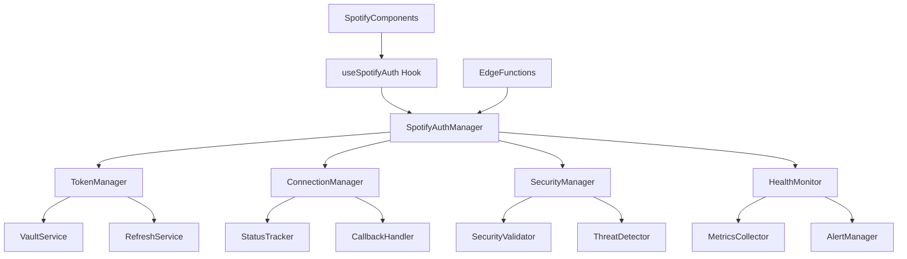

# Task: Consolidate Spotify Authentication System

**Status**: 🔄 In Progress  
**Priority**: P1 (High)  
**Assignee**: Development Team  
**Estimated Effort**: 21 Story Points  
**Due Date**: December 16, 2025

---

## 📋 Task Overview

### Objective
Consolidate the fragmented Spotify authentication system into a unified, maintainable architecture that reduces complexity, improves reliability, and provides a consistent developer experience across all Spotify-related functionality.

### Success Criteria
- [ ] **Unified Architecture**: Single source of truth for Spotify authentication state and operations
- [ ] **Reduced Complexity**: Eliminate duplicate code and conflicting authentication patterns
- [ ] **Improved Reliability**: 99%+ authentication success rate with robust error handling
- [ ] **Enhanced Developer Experience**: Clear, consistent APIs for all Spotify operations
- [ ] **Comprehensive Testing**: 95%+ test coverage with automated validation
- [ ] **Production Ready**: Zero breaking changes for existing functionality

### Scope
**In Scope:**
- Consolidate [`SpotifyService`](../src/services/spotify.service.ts), [`useSpotifyAuth`](../src/hooks/useSpotifyAuth.ts), and [`useSpotifyTokens`](../src/hooks/useSpotifyTokens.ts)
- Unify token management across Phase 4 security services
- Streamline callback handling in [`SpotifyCallback.tsx`](../src/pages/SpotifyCallback.tsx)
- Consolidate connection status components
- Update edge functions for consistency
- Comprehensive testing and documentation

**Out of Scope:**
- Changes to Spotify Web API integration
- Modifications to database schema
- UI/UX redesign (maintain existing interfaces)

---

## 🎯 Requirements

### Functional Requirements
- **FR-1**: Single authentication service managing all Spotify operations
- **FR-2**: Unified token management with automatic refresh and vault integration
- **FR-3**: Consistent error handling across all Spotify components
- **FR-4**: Centralized connection status management
- **FR-5**: Streamlined OAuth callback processing

### Non-Functional Requirements
- **NFR-1**: Authentication operations complete within 2 seconds
- **NFR-2**: 99%+ uptime for authentication services
- **NFR-3**: Zero data loss during consolidation
- **NFR-4**: Backward compatibility with existing components
- **NFR-5**: Enterprise-grade security compliance

### Acceptance Criteria
```gherkin
Given a user wants to connect their Spotify account
When they initiate the OAuth flow
Then they should be redirected to Spotify authorization
And upon successful authorization, be returned to the application
And their connection status should be immediately updated
And all dependent components should reflect the new state

Given a user has an existing Spotify connection
When their token expires
Then the system should automatically refresh the token
And maintain seamless functionality
And log the refresh operation for monitoring

Given a developer wants to check Spotify connection status
When they use the consolidated authentication service
Then they should receive consistent, up-to-date information
And have access to standardized error handling
And be able to perform all necessary operations through a single interface
```

---

## 🏗️ Implementation Plan

### Approach
Implement a phased consolidation approach that maintains backward compatibility while progressively unifying the authentication system. Use the adapter pattern to ensure existing components continue working during the transition.

### Technical Design

#### Current Architecture Analysis
The current system has significant fragmentation:

1. **Multiple Authentication Services**:
   - [`SpotifyService`](../src/services/spotify.service.ts) - Basic connection operations
   - [`SpotifyTokenRefreshService`](../src/services/spotifyTokenRefresh.service.ts) - Token refresh logic
   - [`SpotifyHealthMonitorService`](../src/services/spotifyHealthMonitor.service.ts) - Health monitoring
   - [`SpotifySecurityValidatorService`](../src/services/spotifySecurityValidator.service.ts) - Security validation

2. **Duplicate State Management**:
   - [`useSpotifyAuth`](../src/hooks/useSpotifyAuth.ts) - Global connection state
   - [`useSpotifyTokens`](../src/hooks/useSpotifyTokens.ts) - Token-specific state
   - Multiple components maintaining their own connection status

3. **Inconsistent Error Handling**:
   - Different error patterns across services
   - Inconsistent user feedback mechanisms
   - Fragmented recovery strategies

#### Proposed Unified Architecture



### Implementation Steps

1. **Step 1: Create Unified Authentication Manager**
   - **Deliverable**: `SpotifyAuthManager` service with consolidated APIs
   - **Estimate**: 5 Story Points

2. **Step 2: Implement Unified Token Management**
   - **Deliverable**: Consolidated token handling with vault integration
   - **Estimate**: 4 Story Points

3. **Step 3: Consolidate Connection Management**
   - **Deliverable**: Single source of truth for connection status
   - **Estimate**: 3 Story Points

4. **Step 4: Streamline Component Integration**
   - **Deliverable**: Updated hooks and components using unified service
   - **Estimate**: 4 Story Points

5. **Step 5: Update Edge Functions**
   - **Deliverable**: Consistent edge function interfaces
   - **Estimate**: 2 Story Points

6. **Step 6: Comprehensive Testing**
   - **Deliverable**: Full test suite with 95%+ coverage
   - **Estimate**: 3 Story Points

---

## 🧪 Testing Strategy

### Test Plan
- **Unit Tests**: All service methods and hook behaviors
- **Integration Tests**: End-to-end authentication flows
- **E2E Tests**: Complete user journey from connection to sync
- **Security Tests**: Token handling and vault integration
- **Performance Tests**: Authentication timing and reliability

### Test Cases
| Test Case | Description | Expected Result | Status |
|-----------|-------------|-----------------|--------|
| TC-1 | Initial Spotify connection | Successful OAuth flow completion | ⏳ Pending |
| TC-2 | Token refresh on expiration | Automatic token renewal | ⏳ Pending |
| TC-3 | Connection status consistency | All components show same status | ⏳ Pending |
| TC-4 | Error handling and recovery | Graceful error states and recovery | ⏳ Pending |
| TC-5 | Security validation | Threat detection and response | ⏳ Pending |
| TC-6 | Performance under load | Sub-2s response times | ⏳ Pending |

### Testing Commands
```bash
# Unit tests
npm test spotify-auth

# Integration tests
npm run test:integration:spotify

# E2E tests
npm run test:e2e:spotify-auth

# Security tests
npm run test:security:spotify

# Performance tests
npm run test:performance:auth
```

---

## 🔗 Dependencies

### Prerequisites
- [ ] **Phase 4 Security Services**: Complete implementation of vault-based token storage
- [ ] **Authentication Context**: Stable [`NewAuthContext`](../src/contexts/NewAuthContext.tsx) implementation
- [ ] **Database Schema**: Current Spotify connection tables and RLS policies

### Blocking Tasks
- [ ] **Security Review**: Complete security audit of current token handling
- [ ] **Performance Baseline**: Establish current authentication performance metrics

### Related Tasks
- **Authentication System**: [`docs/systems/authentication.md`](systems/authentication.md) - Depends on unified Spotify auth
- **Genre Classification**: Requires stable Spotify connection for API calls
- **Data Sync**: Depends on reliable token management

---

## 📊 Progress Tracking

### Milestones
- [ ] **Milestone 1**: Unified Service Architecture - Due: December 11, 2025
- [ ] **Milestone 2**: Component Integration Complete - Due: December 13, 2025
- [ ] **Milestone 3**: Testing and Validation Complete - Due: December 15, 2025
- [ ] **Milestone 4**: Production Deployment - Due: December 16, 2025

### Daily Progress
| Date | Work Completed | Issues Encountered | Next Steps |
|------|----------------|-------------------|------------|
| 2025-12-09 | Architecture analysis and task planning | Complex interdependencies identified | Begin unified service design |

---

## 🚨 Risks & Issues

### Identified Risks
| Risk | Probability | Impact | Mitigation |
|------|-------------|--------|------------|
| Breaking existing functionality | Medium | High | Comprehensive testing and backward compatibility |
| Token management complexity | High | Medium | Phased implementation with fallback mechanisms |
| Performance regression | Low | Medium | Performance testing and monitoring |
| Security vulnerabilities | Low | High | Security review and validation testing |

### Current Issues
- **Issue #1**: Multiple authentication state sources causing race conditions
  - **Status**: Open
  - **Assigned**: Development Team
  - **ETA**: December 11, 2025

---

## 📝 Implementation Notes

### Technical Decisions
- **Decision 1**: Use adapter pattern for backward compatibility during transition
- **Decision 2**: Implement singleton pattern for unified authentication manager
- **Decision 3**: Maintain existing hook interfaces while consolidating underlying logic

### Code Changes
- **Files Modified**: 
  - `src/services/spotify.service.ts` - Consolidate into unified manager
  - `src/hooks/useSpotifyAuth.ts` - Update to use unified service
  - `src/hooks/useSpotifyTokens.ts` - Merge functionality into main hook
  - `src/pages/SpotifyCallback.tsx` - Streamline callback handling
  - `src/components/spotify/*` - Update to use consolidated APIs

- **New Files**: 
  - `src/services/spotifyAuthManager.service.ts` - Unified authentication manager
  - `src/services/spotifyConnectionManager.service.ts` - Connection state management
  - `src/hooks/useUnifiedSpotifyAuth.ts` - Consolidated authentication hook

- **Dependencies Added**: None (consolidation reduces dependencies)

### Database Changes
- **Schema Changes**: None required
- **Migration Scripts**: None required
- **Data Changes**: None required

---

## 🔍 Review & Validation

### Code Review Checklist
- [ ] **Functionality**: All existing features work without regression
- [ ] **Quality**: Code follows established patterns and standards
- [ ] **Testing**: Comprehensive test coverage with passing tests
- [ ] **Documentation**: Updated documentation and inline comments
- [ ] **Performance**: No performance regressions detected
- [ ] **Security**: Security review passed with no vulnerabilities

### Validation Steps
1. **Development Testing**: Validate all authentication flows in development
2. **Staging Validation**: Complete end-to-end testing in staging environment
3. **Security Review**: Independent security audit of consolidated system
4. **Performance Testing**: Load testing and performance validation
5. **Production Readiness**: Final checklist and deployment preparation

---

## 📚 Resources

### Documentation
- **Current Auth System**: [`docs/systems/authentication.md`](systems/authentication.md)
- **Spotify OAuth Config**: [`docs/spotify-oauth-production-config.md`](spotify-oauth-production-config.md)
- **Phase 4 Security**: [`README-PHASE4-SETUP.md`](../README-PHASE4-SETUP.md)

### External Resources
- **Spotify Web API**: [https://developer.spotify.com/documentation/web-api/](https://developer.spotify.com/documentation/web-api/)
- **OAuth 2.0 Best Practices**: [https://datatracker.ietf.org/doc/html/draft-ietf-oauth-security-topics](https://datatracker.ietf.org/doc/html/draft-ietf-oauth-security-topics)
- **Supabase Auth**: [https://supabase.com/docs/guides/auth](https://supabase.com/docs/guides/auth)

### Architecture Patterns
- **Singleton Pattern**: For unified authentication manager
- **Adapter Pattern**: For backward compatibility during transition
- **Observer Pattern**: For connection status updates
- **Strategy Pattern**: For different authentication flows

---

## 📋 Change Log

### Updates
- **2025-12-09**: Initial task definition and architecture analysis
- **2025-12-09**: Created comprehensive consolidation plan
- **2025-12-09**: Identified key risks and mitigation strategies

### Version History
- **v1.0**: Initial task definition with comprehensive scope and requirements