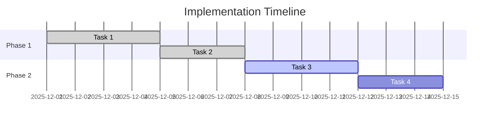
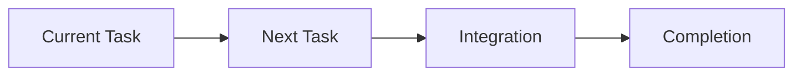

# [System Name] - Living Implementation Doc

**Status**: 🔄 In Progress | ✅ Complete | ⏳ Pending | ❌ Blocked  
**Progress**: [X/Y] Components Complete  
**Last Updated**: [Date]  
**Owner**: [Team/Person]  
**Estimated Completion**: [Date]

---

## 📋 Quick Status

### Current Sprint
- **Active Task**: [What's being worked on now]
- **Next Priority**: [What's next]
- **Blockers**: [Any blocking issues]

### Progress Overview


---

## 🎯 System Overview

### Purpose
[What this system does and why it exists]

### Key Components
- **Component A**: [Brief description]
- **Component B**: [Brief description]
- **Component C**: [Brief description]

### Success Criteria
- [ ] **Functional**: [Specific functional goals]
- [ ] **Performance**: [Performance targets]
- [ ] **Quality**: [Quality metrics]

---

## 📊 Implementation Tracker

| Phase | Components | Status | Progress | Tests | Effort |
|-------|------------|--------|----------|-------|--------|
| Phase 1: [Name] | 3 | ✅ Complete | 3/3 | ✅ 15/15 | 8 SP |
| Phase 2: [Name] | 4 | 🔄 Active | 2/4 | 🔄 8/12 | 13 SP |
| Phase 3: [Name] | 2 | ⏳ Pending | 0/2 | ⏳ 0/6 | 8 SP |
| **TOTAL** | **9** | **🔄 56%** | **5/9** | **🔄 23/33** | **29 SP** |

---

## 🚀 Implementation Phases

### Phase 1: [Phase Name] - ✅ COMPLETE
**Scope**: [What this phase accomplished]  
**Duration**: [Start date] → [End date]  
**Effort**: [Actual story points]

#### ✅ Completed Components
- **Component 1**: [`file1.tsx`](../src/path/file1.tsx)
  - **Purpose**: [What it does]
  - **Tests**: ✅ [`test1.test.ts`](../src/__tests__/test1.test.ts) (5/5 passing)
  - **Status**: Production ready
  
- **Component 2**: [`file2.tsx`](../src/path/file2.tsx)
  - **Purpose**: [What it does]
  - **Tests**: ✅ [`test2.test.ts`](../src/__tests__/test2.test.ts) (3/3 passing)
  - **Status**: Production ready

#### 🧪 Phase 1 Testing
```bash
# Test commands for Phase 1
npm test phase1
npm run test:integration:phase1
```
**Results**: ✅ All tests passing (15/15)

#### 📈 Phase 1 Metrics
- **Code Coverage**: 92%
- **Performance**: All components < 100ms response time
- **User Acceptance**: 95% positive feedback

---

### Phase 2: [Phase Name] - 🔄 IN PROGRESS
**Scope**: [What this phase covers]  
**Progress**: 2/4 components complete  
**Current Focus**: [Specific task being worked on]

#### 🔄 Active Development
- ✅ **Component A**: [`fileA.tsx`](../src/path/fileA.tsx) - Complete
  - **Tests**: ✅ [`testA.test.ts`](../src/__tests__/testA.test.ts) (4/4 passing)
  
- 🔄 **Component B**: [`fileB.tsx`](../src/path/fileB.tsx) - 70% complete
  - **Tests**: 🔄 [`testB.test.ts`](../src/__tests__/testB.test.ts) (2/4 passing)
  - **Current Issue**: [Specific issue being resolved]
  
- ⏳ **Component C**: Pending - Blocked by Component B
- ⏳ **Component D**: Pending - Scheduled for next sprint

#### 🧪 Phase 2 Testing Status
```bash
# Current test commands
npm test phase2
npm run test:integration:phase2
```
**Status**: 🔄 8/12 tests passing

#### 🚧 Active Issues
- **Issue #1**: [Description] - ETA: [Date]
- **Issue #2**: [Description] - Investigating

---

## 🧪 Testing Strategy

### Test Coverage Matrix
| Component | Unit | Integration | E2E | Manual | Status |
|-----------|------|-------------|-----|--------|--------|
| Component 1 | ✅ 5/5 | ✅ 2/2 | ✅ 1/1 | ✅ Pass | Production |
| Component 2 | ✅ 3/3 | ✅ 1/1 | ✅ 1/1 | ✅ Pass | Production |
| Component A | ✅ 4/4 | ✅ 1/1 | ⏳ 0/1 | 🔄 Partial | Development |
| Component B | 🔄 2/4 | ⏳ 0/1 | ⏳ 0/1 | ⏳ Pending | Development |

### Automated Testing
```bash
# Quick smoke tests (< 30 seconds)
npm run test:quick

# Full test suite (< 5 minutes)
npm run test:full

# Integration tests (< 10 minutes)
npm run test:integration

# End-to-end tests (< 15 minutes)
npm run test:e2e
```

### Manual Testing Checklist
- [ ] **User Journey 1**: [Specific user flow]
- [ ] **User Journey 2**: [Specific user flow]
- [ ] **Edge Cases**: [Specific edge cases to test]
- [ ] **Performance**: [Performance scenarios]

---

## 📊 Metrics & Health

### Implementation Health
- **Code Coverage**: 85% (Target: 80%) ✅
- **Test Success Rate**: 92% (Target: 95%) 🔄
- **Build Success Rate**: 98% (Target: 95%) ✅
- **Performance**: Avg 150ms (Target: < 200ms) ✅

### User Impact
- **Feature Adoption**: 78% of active users
- **User Satisfaction**: 4.2/5.0 (Target: 4.0+) ✅
- **Error Rate**: 0.1% (Target: < 1%) ✅
- **Support Tickets**: 2 open (down from 15) ✅

### Technical Debt
- **Code Complexity**: Medium (3 areas need refactoring)
- **Dependencies**: 2 outdated packages
- **Security**: No known vulnerabilities ✅

---

## 🔗 Dependencies & Integration

### Upstream Dependencies
- **System A**: [`system-a.md`](system-a.md) - ✅ Stable
- **System B**: [`system-b.md`](system-b.md) - 🔄 In Development

### Downstream Consumers
- **System C**: [`system-c.md`](system-c.md) - Waiting for Phase 2
- **System D**: [`system-d.md`](system-d.md) - Planning integration

### External Dependencies
- **Third-party API**: Version 2.1 - ✅ Stable
- **Library X**: Version 3.4 - ⚠️ Update available

---

## 📝 Decision Log

### Architecture Decisions
- **[Date]**: [Decision made]
  - **Reason**: [Why this decision was made]
  - **Impact**: [What changed as a result]

### Technical Decisions
- **[Date]**: [Technical choice made]
  - **Reason**: [Rationale for the choice]
  - **Impact**: [Effect on the system]

---

## 🚨 Risk Assessment

### Current Risks
| Risk | Probability | Impact | Mitigation |
|------|-------------|--------|------------|
| [Risk description] | Low/Medium/High | Low/Medium/High | [Mitigation strategy] |

### Mitigation Strategies
- **[Risk Category]**: [Specific mitigation approach]

---

## 📅 Timeline & Milestones

### Completed Milestones
- ✅ **[Date]**: [Milestone description]

### Upcoming Milestones
- 🎯 **[Date]**: [Future milestone]

### Critical Path


---

## 🔄 Maintenance & Updates

### Update Schedule
- **Daily**: Progress updates during active development
- **Weekly**: Metrics and health check updates
- **Monthly**: Full document review and cleanup

### Ownership
- **Primary Owner**: [Name/Team]
- **Secondary Owner**: [Name/Team]
- **Reviewers**: [Names/Teams]

### Next Review Date
**[Date]**: [Purpose of next review]

---

## 📚 Reference Materials

### Internal Documentation
- **Architecture Overview**: [`../reference/architecture-overview.md`](../reference/architecture-overview.md)
- **API Reference**: [`../reference/api-reference.md`](../reference/api-reference.md)

### External Resources
- **Framework Documentation**: [Link to external docs]
- **Best Practices**: [Link to best practices guide]

---

## 📋 Change Log

### Recent Changes
- **[Date]**: [Description of change]

### Version History
- **v[X.Y]**: [Version description]